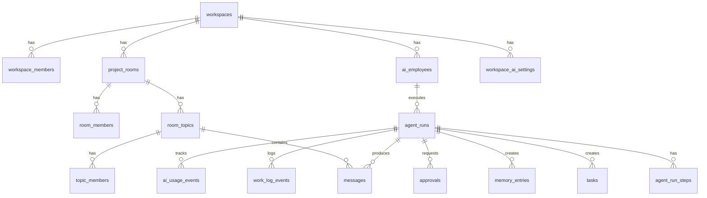

## Bootstrap

Fresh projects: run `supabase/schema.sql` in the Supabase SQL editor.

Existing projects: apply migrations in order from `supabase/migrations/`.

<Warning>
`schema.sql` does not yet include Messaging v2 topic tables. Production must apply migration `20250629160000`.
</Warning>

## Entity relationship



## Tables by domain

### Auth & workspace

| Table | Key columns |
|-------|-------------|
| `profiles` | `id` (FK auth.users), `name`, `avatar_url` |
| `workspaces` | `owner_id`, `workspace_mode`, `onboarding_complete` |
| `workspace_members` | `workspace_id`, `user_id`, `role`, `status` |
| `workspace_invitations` | `email`, `token`, `role` |

### Workforce

| Table | Key columns |
|-------|-------------|
| `ai_employees` | PK `(workspace_id, id)`, `role_key`, `provider`, `model_mode`, `permissions` |
| `employee_tools` | `employee_id`, `tool_id`, `access_level` |

### Rooms & messaging

| Table | Key columns |
|-------|-------------|
| `project_rooms` | PK `(workspace_id, id)`, `kind`, `dm_employee_id` |
| `room_members` | `room_id`, `member_type`, `member_id` |
| `room_topics` | `room_id`, `title`, `status`, `metadata`, counters |
| `topic_members` | `topic_id`, `member_type`, `last_read_message_id` |
| `messages` | `room_id`, `topic_id`, `sender_type`, `mentions_json`, `agent_run_id` |
| `message_reactions` | `message_id`, `emoji`, `user_id` |

### Work graph

| Table | Key columns |
|-------|-------------|
| `tasks` | `topic_id`, `status`, `created_by_run_id` |
| `memory_entries` | `topic_id`, `type`, `content` |
| `approvals` | `topic_id`, `risk_level`, `action_type`, `status` |
| `work_log_events` | `topic_id`, `event_type`, `agent_run_id` |
| `calls` | Simulated call metadata |
| `call_transcripts` | Transcript lines |

### AI runtime

| Table | Key columns |
|-------|-------------|
| `workspace_ai_settings` | `daily_token_limit`, `daily_cost_limit_usd`, `max_parallel_runs` |
| `agent_runs` | `status`, `employee_id`, `topic_id`, `trigger_message_id` |
| `agent_run_steps` | `step_type`, `payload` |
| `ai_usage_events` | `tokens_in`, `tokens_out`, `estimated_cost_usd` |
| `model_provider_configs` | BYOK placeholder (admin write) |

### Tools

| Table | Key columns |
|-------|-------------|
| `tools` | Global catalog (seeded) |
| `workspace_tools` | Per-workspace connection status |

## Row-level security

RLS is enabled on all workspace-scoped tables. Helper functions in `schema.sql`:

```sql
is_workspace_member(workspace_id uuid) → boolean
is_workspace_admin(workspace_id uuid) → boolean
shares_workspace_with(user_id uuid) → boolean
```

General pattern:

- **Read:** any workspace member
- **Write:** members (some tables admin-only for sensitive ops)
- **AI usage read:** admin only
- **Provider configs write:** admin only

## TypeScript mirror

Domain types in `src/lib/types.ts` mirror the database schema for client-side use.

## Related

- [Migrations](/database/migrations) — incremental schema changes
- [Supabase integration](/integrations/supabase)
