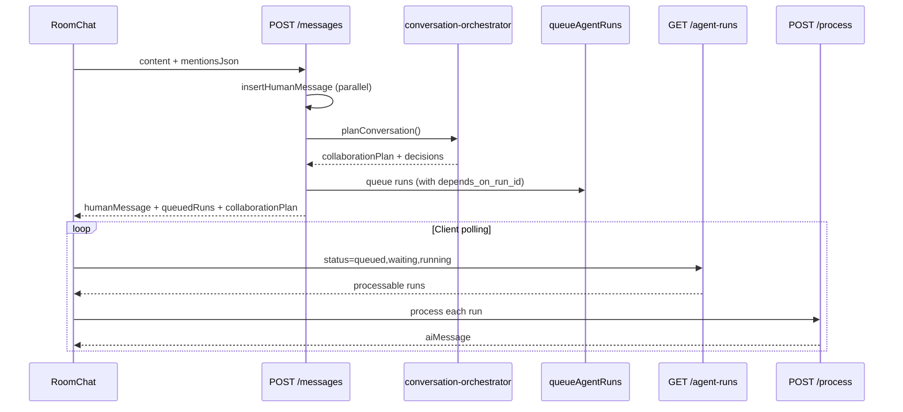

## Overview

When a human sends a message, AdeHQ doesn't just pick one @mentioned employee. The **conversation orchestrator** classifies the message, builds a collaboration plan, queues dependent agent runs, and the client processes them asynchronously.

Introduced in V16.8 (governance) and V16.9 (orchestrator + dependencies).

## End-to-end flow



## Conversation modes

| Mode | Example input | Plan |
|------|---------------|------|
| `direct_reply` | `@Engineer review this` | Single responder |
| `lead_collaborator` | `@PM work with @Engineer on the spec` | Lead first, collaborator waits |
| `panel_response` | `What do you both think?` | Parallel responders |
| `broadcast_social` | `Hey team!` | One greeting employee |
| `ambient_smart` | `Can someone look at the API?` | Smart role match (if mode allows) |
| `silent` | AI stopped, or "note for tomorrow" | No runs |

## Collaboration plan

Returned on every message send as `collaborationPlan`:

```json
{
  "mode": "lead_collaborator",
  "collaborationId": "collab_msg-id",
  "rootTriggerMessageId": "msg-id",
  "status": "active",
  "participants": [
    { "employeeId": "pm-1", "employeeName": "PM", "role": "lead" },
    { "employeeId": "eng-1", "employeeName": "Engineer", "role": "collaborator", "waitingOnEmployeeId": "pm-1" }
  ],
  "staggerMs": 800
}
```

UI component: `CollaborationPlanBanner` shows active collaboration status.

## Run dependencies

Collaborator runs have `depends_on_run_id` pointing to the lead run. Status flow:

1. Lead run: `queued` → `running` → `completed`
2. Collaborator run: `waiting` → `queued` → `running` → `completed`

Client determines processability via `GET /api/rooms/:roomId/topics/:topicId/agent-runs`.

## Channel governance rules

| Constant | Value | File |
|----------|-------|------|
| Ambient cooldown | 3 min | `channel-governance.ts` |
| Max AI-to-AI hops | 2 | `channel-governance.ts` |
| Max follow-ups per root | 3 | `channel-governance.ts` |
| Greeting max tokens | 120 | `channel-governance.ts` |

Low-action messages (`thanks`, `ok`, `👍`) skip ambient responses. Action verbs (`draft`, `review`, `build`) trigger smart assist when enabled.

## Topic AI controls

Users can stop, pause, or block AI per topic from the topic panel (V17: collapsible AI settings section).

| Action | API action | Effect |
|--------|------------|--------|
| Stop all AI | `stop_all` | Sets `aiStopped`, cancels active runs |
| Resume | `resume` | Clears all blocks |
| Pause smart assist | `pause_smart` | Pauses for N minutes (default 60) |
| Stop one employee | `stop_employee` | Adds to `blockedEmployeeIds` |
| Resume one employee | `resume_employee` | Removes from block list |

Helper module: `src/lib/topic-ai-control.ts`

## Employee participation style

New column `ai_employees.participation_style` (V16.8):

| Style | Use |
|-------|-----|
| `balanced_teammate` | Default |
| `social_coordinator` | Preferred for group greetings |

## AI reply sanitization (V16.1)

Structured LLM output is normalized before display — raw JSON no longer leaks into DMs or channels.

| Module | Role |
|--------|------|
| `normalize-model-response.ts` | Strip JSON wrappers, extract reply text |
| `sanitize-effects.ts` | Clean side-effect payloads |
| `structured-llm-call.ts` | Zod-validated LLM responses |

## Related

- [Channel orchestration PRD](/prds/channel-orchestration)
- [Messaging](/features/messaging)
- [Agents API](/api/agents)
- [Topics API — AI control](/api/topics)
