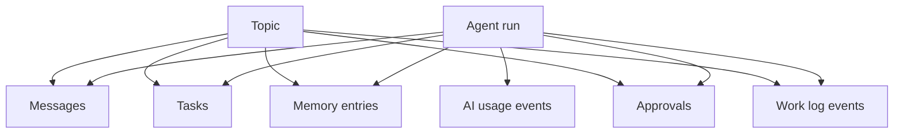

## Overview

The **work graph** is everything AI employees produce beyond chat messages. All entities link to `agent_run_id` and optionally `topic_id` for traceability.

## Tasks

Kanban board at `/tasks`. Created by AI effects or manually commit.

| Field | Description |
|-------|-------------|
| `status` | `todo`, `in_progress`, `done`, `cancelled` |
| `priority` | Task priority level |
| `topic_id` | Optional link to originating topic |
| `created_by_run_id` | Agent run that created the task |

UI: `TaskCard`, task board in `src/app/(app)/tasks/page.tsx`.

## Memory

Searchable knowledge base at `/memory`. Types:

| Type | Use |
|------|-----|
| `decision` | Recorded decisions |
| `research` | Research findings |
| `architecture` | Technical architecture notes |
| `preference` | User/team preferences |
| `instruction` | Standing instructions |
| `general` | Catch-all |

Topic summarization can create draft memory entries.

UI: `MemoryCard`, grouped by room in memory browser.

## Approvals

Queue at `/approvals` for human review of high-risk AI actions.

| Field | Description |
|-------|-------------|
| `risk_level` | `low`, `medium`, `high`, `critical` |
| `action_type` | What the AI wants to do |
| `status` | `pending`, `approved`, `rejected` |

When an approval is required, the agent run enters `waiting_approval` status.

UI: `ApprovalCard`.

## Work log

Audit trail at `/work-log`. Every significant AI action creates an event:

- Model calls (live vs fallback)
- Permission blocks
- Task/memory/approval creation
- Errors and retries

UI: `WorkLogTimeline`.

## Persistence

All work graph CRUD goes through `demo-store.tsx` actions → `persist*` functions in `src/lib/supabase/persistence.ts`.

When `backend === "supabase"`, changes sync to Postgres and propagate via Realtime.

## Clear workspace

Owners/admins can wipe all work graph data via **Settings → Clear workspace data**. Type `CLEAR WORKSPACE` to confirm. Preserves workspace, owner, and members.

## Database tables

| Table | Migration |
|-------|-----------|
| `tasks` | Base schema + `topic_id` in messaging v2 |
| `memory_entries` | Base schema + `topic_id` |
| `approvals` | Base schema + `topic_id` |
| `work_log_events` | Base schema + `topic_id` |
| `agent_runs` | `20250629120000_ai_runtime_and_work_graph.sql` |
| `agent_run_steps` | Same migration |
| `ai_usage_events` | Same migration |

## Related

- [AI runtime PRD](/prds/ai-runtime)
- [Database schema](/database/schema)
