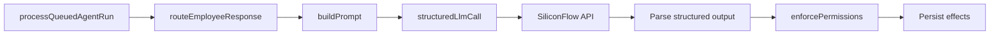

## Overview

SiliconFlow is the **only live LLM provider** in production. All AI employee responses route through SiliconFlow via the Vercel AI SDK's OpenAI-compatible adapter.

Legacy provider values (e.g. `openai`) are coerced to `siliconflow` by migration `20250629140000`.

## Configuration

| Variable | Purpose |
|----------|---------|
| `SILICONFLOW_API_KEY` | API authentication |
| `SILICONFLOW_API_BASE_URL` | Default `https://api.siliconflow.com/v1` |
| `ADEHQ_SILICONFLOW_MODEL` | Balanced tier default |
| `ADEHQ_SILICONFLOW_CHEAP_MODEL` | Cheap tier |
| `ADEHQ_SILICONFLOW_CODER_MODEL` | Coding tier |
| `ADEHQ_SILICONFLOW_LONG_CONTEXT_MODEL` | Long context tier |
| `ADEHQ_SILICONFLOW_STRONG_MODEL` | Strong tier |

Check: `isSiliconFlowConfigured()` in `src/lib/config/features.ts`

## Key files

| File | Purpose |
|------|---------|
| `src/lib/ai/siliconflow-client.ts` | AI SDK client setup |
| `src/lib/ai/siliconflow-call.ts` | Raw LLM call wrapper |
| `src/lib/ai/structured-llm-call.ts` | Structured output (Zod schemas) |
| `src/lib/ai/model-router.ts` | Route employee → model → call |
| `src/lib/ai/model-catalog.ts` | Mode → model mapping |
| `src/lib/ai/prompts.ts` | System/user prompt construction |
| `src/lib/ai/cost-guard.ts` | Pre-run cost checks |

## Model routing

Each AI employee has a `model_mode` that maps to a SiliconFlow model:

```typescript
// src/lib/ai/model-catalog.ts
const MODEL_MAP = {
  cheap: SILICONFLOW_CHEAP_MODEL,
  balanced: SILICONFLOW_MODEL,
  strong: SILICONFLOW_STRONG_MODEL,
  coding: SILICONFLOW_CODER_MODEL,
  long_context: SILICONFLOW_LONG_CONTEXT_MODEL,
  creative: SILICONFLOW_MODEL,
};
```

Override defaults via `ADEHQ_SILICONFLOW_*` env vars.

## Call flow



Structured output uses Zod schemas for reliable parsing of AI responses including tasks, memory, and approval requests.

## Fallback behavior

When SiliconFlow is unavailable:

1. `isSiliconFlowConfigured()` returns false → mock engine
2. API call fails → catch, log work log event, optional scripted fallback
3. App continues functioning — human messaging is never blocked

Fallback engine: `src/lib/ai/employee-engine.ts` (deterministic role-based responses).

## Cost tracking

Every live call records an `ai_usage_events` row:

- `tokens_in`, `tokens_out`
- `estimated_cost_usd`
- `model`, `provider`
- Linked to `agent_run_id` and `topic_id`

Daily limits checked in `beginAiRun()` against `workspace_ai_settings`.

## Testing

### Settings UI

Settings → AI Runtime → **Test provider** calls `POST /api/ai/test-provider`.

### Manual API test

```bash
curl -X POST https://your-app/api/ai/test-provider \
  -H "Authorization: Bearer YOUR_TOKEN" \
  -H "Content-Type: application/json" \
  -d '{"modelMode": "balanced"}'
```

Expected: `{ "ok": true, "model": "...", "latencyMs": N }`

### Room test

1. Confirm provider test passes
2. Open a room, @mention an employee
3. Check work log for `live` (not `fallback`) model call

## Related

- [AI runtime PRD](/prds/ai-runtime)
- [AI settings API](/api/ai-settings)
- [Environment variables](/development/environment)
