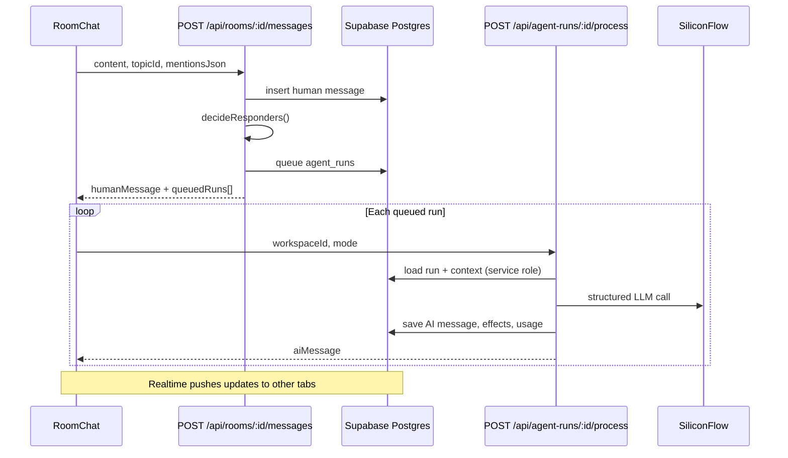

## Stack

| Layer | Technology | Key paths |
|-------|------------|-----------|
| Frontend | Next.js 14 App Router, React, Tailwind | `src/app/`, `src/components/` |
| State | React context store + Supabase Realtime | `src/lib/demo-store.tsx` |
| Auth | Supabase Auth (email/password) | `src/lib/supabase/`, `src/lib/auth/` |
| Database | Supabase Postgres + RLS | `supabase/schema.sql`, `supabase/migrations/` |
| AI | SiliconFlow via Vercel AI SDK | `src/lib/ai/` |
| Deployment | Vercel | `NEXT_PUBLIC_SITE_URL` |

There is **no middleware.ts**. Route protection is client-side in `AppShell` plus Bearer-token auth on API routes.

## Directory layout

```
src/
  app/
    (auth)/          login, signup
    (app)/           authenticated pages (AppShell)
    api/             route handlers (no Server Actions)
  components/        UI components
  lib/
    demo-store.tsx   central workspace state
    supabase/        client, persistence, auth-server
    ai/              model routing, prompts, cost guard
    server/          room access, message pipeline, topic helpers
    types.ts         domain types
supabase/
  schema.sql         bootstrap schema
  migrations/        incremental patches
docs/                this documentation (Mintlify)
```

## Request flow: human message → AI reply



## Responder selection

`decideResponders()` (`src/lib/server/decide-responders.ts`) determines which AI employees respond:

1. **Explicit mention** — `@Employee Name` in content or `mentionsJson`
2. **Smart assist** — topic `aiParticipationMode` is `smart_assist` or `active_team`
3. **DM default** — in a DM room on the General topic, the counterpart employee always responds
4. **Slash command** — forced employee IDs from chat composer

Parallelism is capped by `workspace_ai_settings.max_parallel_runs` (default 3).

## Auth pattern

| Context | Mechanism |
|---------|-----------|
| Browser | Supabase session via `@supabase/supabase-js` |
| API routes | `Authorization: Bearer <access_token>` → `requireAuthUser()` |
| Workspace scope | `requireWorkspaceMembership()` checks role |
| Room scope | `assertCanSendRoomMessage()` / `assertCanAccessRoom()` |
| Agent processing | User auth + **service role client** for writes that bypass RLS gaps |

Client helper: `src/lib/api/auth-client.ts` attaches the Bearer token to fetch calls.

## Realtime sync

When `backend === "supabase"`, the store subscribes to Postgres changes on all workspace tables (`SUPABASE_WORKSPACE_TABLES` in `src/lib/supabase/config.ts`) with a 250ms debounced reload.

## AI model routing

Employees have a `model_mode` that maps to SiliconFlow models via `src/lib/ai/model-catalog.ts`:

| Mode | Env var | Default model |
|------|---------|---------------|
| `cheap` | `ADEHQ_SILICONFLOW_CHEAP_MODEL` | DeepSeek-V3 |
| `balanced` | `ADEHQ_SILICONFLOW_MODEL` | DeepSeek-V4-Flash |
| `strong` | `ADEHQ_SILICONFLOW_STRONG_MODEL` | DeepSeek-V4-Pro |
| `coding` | `ADEHQ_SILICONFLOW_CODER_MODEL` | Qwen3-Coder-30B |
| `long_context` | `ADEHQ_SILICONFLOW_LONG_CONTEXT_MODEL` | MiniMax-M2.5 |

If `SILICONFLOW_API_KEY` is missing or a call fails, the runtime falls back to scripted responses and logs a work log event — the app does not crash.

## Cost governance

`beginAiRun()` in `src/lib/ai/cost-guard.ts` checks workspace limits before queuing:

- Daily token budget
- Daily cost cap
- Max parallel runs
- Max handoff depth

Settings live in `workspace_ai_settings` and are editable by owner/admin via `PATCH /api/workspaces/:id/ai-settings`.
