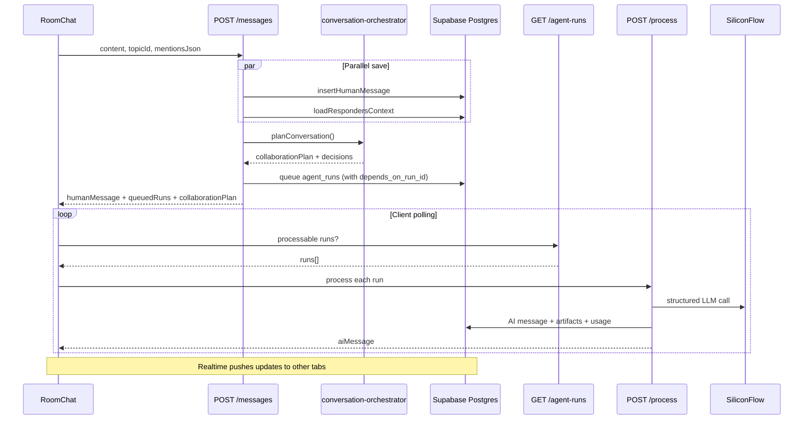

## Stack

| Layer | Technology | Key paths |
|-------|------------|-----------|
| Frontend | Next.js 14 App Router, React, Tailwind | `src/app/`, `src/components/` |
| State | React context store + Supabase Realtime | `src/lib/demo-store.tsx` |
| Auth | Supabase Auth (email/password) | `src/lib/supabase/`, `src/lib/auth/` |
| Database | Supabase Postgres + RLS | `supabase/schema.sql`, `supabase/migrations/` |
| AI | SiliconFlow via Vercel AI SDK | `src/lib/ai/` |
| Deployment | Vercel | `NEXT_PUBLIC_SITE_URL` |

There is **no middleware.ts**. Route protection is client-side in `AppShell` plus Bearer-token auth on API routes.

## Directory layout

```
src/
  app/
    (auth)/          login, signup
    (app)/           authenticated pages (AppShell)
    api/             route handlers (no Server Actions)
  components/        UI components
  lib/
    demo-store.tsx   central workspace state
    supabase/        client, persistence, auth-server
    ai/              model routing, prompts, normalization
    server/          orchestrator, governance, message pipeline
    rooms.ts         channel vs DM helpers
    topic-ai-control.ts  runtime AI stop/pause
    types.ts         domain types
supabase/
  schema.sql         bootstrap schema
  migrations/        incremental patches (through V16.9)
```

Docs: [NexCache-Official/docs](https://github.com/NexCache-Official/docs)

## Request flow: human message → AI reply (V16.9)



Key change from V16.8: AI replies are **not returned inline** from the messages endpoint. The client polls and processes runs asynchronously.

## Conversation orchestration

`planConversation()` in `conversation-orchestrator.ts` replaces simple `decideResponders()` for channel messages:

1. Resolve @mentions in order
2. Classify conversation mode (`direct_reply`, `lead_collaborator`, `panel_response`, etc.)
3. Apply channel governance (cooldowns, greeting detection)
4. Check topic AI controls (`aiStopped`, blocked employees)
5. Build collaboration plan with participant roles

Collaborator runs wait on `depends_on_run_id` until the lead completes.

## Responder selection (legacy path)

`decideResponders()` still handles DM rooms and simple cases:

1. **Explicit mention** — `@Employee Name`
2. **Smart assist** — topic participation mode + role heuristics
3. **DM default** — counterpart employee on General/Direct Chat topic
4. **Slash command** — forced employee IDs

## Auth pattern

| Context | Mechanism |
|---------|-----------|
| Browser | Supabase session |
| API routes | Bearer JWT → `requireAuthUser()` |
| Destructive ops | + `requirePasswordReauth()` (V16.3) |
| Agent processing | User auth + service role client |

## Signup & onboarding flow (V16.5+)

```mermaid
flowchart LR
  A[Signup] --> B[Confirm email]
  B --> C[Login]
  C --> D[/onboarding]
  D --> E[POST /workspaces/bootstrap]
  E --> F[Hire employee + create room]
  F --> G[Persist to Supabase]
```

Workspace is **not** created at signup — only during onboarding.

## Channels vs DMs (V16.7)

| Kind | `dm_employee_id` | UI label | Created by |
|------|------------------|----------|------------|
| `channel` | Must be null | Project room | Create room modal |
| `dm` | Required | Direct message | Hire employee |

DB constraint: `project_rooms_kind_shape`

## AI reply pipeline

```
Structured LLM call → normalize-model-response → sanitize-effects
→ enforcePermissions → persist message + artifacts → queue follow-ups
```

Artifacts (V16.2): tasks, memory, approvals, work log entries, email drafts attached inline to AI messages.

## Cost governance

Unchanged — `beginAiRun()` checks workspace limits before queuing. See [AI runtime PRD](/prds/ai-runtime).

## Related

- [Channel orchestration](/features/channel-orchestration)
- [Messaging](/features/messaging)
- [Platform overview](/platform/overview)
