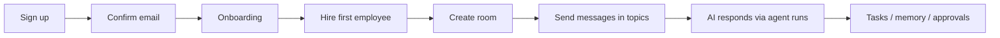

AdeHQ lets teams hire AI employees, organize work in project rooms, and collaborate through topic-based messaging — similar to Slack channels with Zulip-style threads.

## Core concepts

| Concept | Description |
|---------|-------------|
| **Workspace** | Tenant boundary. One owner, members with roles (`owner`, `admin`, `member`, `viewer`). |
| **AI employee** | A configured agent with role, model tier, permissions, and tools. Responds in rooms when mentioned or via smart participation. |
| **Project room** | A channel (`kind: channel`) or direct message with one AI employee (`kind: dm`). |
| **Topic** | A thread inside a room. Every room has a default **General** topic. Work graph items (tasks, memory, approvals) link to topics. |
| **Agent run** | A queued or executing AI response job. Tracks steps, cost, and links to the trigger message. |
| **Work graph** | Tasks, memory entries, approvals, and work log events — all auditable and linked to agent runs. |

## User journey

## App surfaces

All authenticated routes live under the `(app)` route group and are wrapped by `AppShell` (`src/components/AppShell.tsx`).

| Route | Purpose |
|-------|---------|
| `/` | Dashboard — workforce stats, recent activity |
| `/rooms` | Channel list |
| `/rooms/[roomId]` | **Primary workspace** — topic list, chat, AI participation |
| `/workforce` | AI employee directory |
| `/workforce/[employeeId]` | Employee profile, model mode, permissions |
| `/tasks` | Kanban task board |
| `/memory` | Searchable knowledge base |
| `/approvals` | Pending action review queue |
| `/work-log` | Audit trail of AI actions |
| `/tools` | Tool catalog (mostly mock connections) |
| `/calls` | Simulated workforce calls |
| `/settings` | Profile, workspace, AI runtime, clear workspace |

## Dual backend model

AdeHQ supports two runtime backends controlled by the client store (`src/lib/demo-store.tsx`):

| Backend | When | Behavior |
|---------|------|----------|
| `supabase` | Production / real auth | All data in Postgres, Realtime sync, API routes for AI |
| `demo` | `NEXT_PUBLIC_ENABLE_DEMO_MODE=true` | In-memory seeded state, scripted AI via `employee-engine.ts` |

Production users always use the Supabase backend. Demo mode is for local evaluation only.

## What's intentionally not built

These are out of scope for the current platform. Do not document or implement them without an explicit PRD:

- Real Slack / GitHub / Notion OAuth integrations
- Billing and subscriptions
- Browserbase / virtual computers
- MCP server connections
- Real VoIP calls
- BYOK encryption for provider keys
- Multi-provider model marketplace (SiliconFlow only in production)

## Related docs

- [Architecture](/platform/architecture) — technical stack and data flow
- [Messaging v2 PRD](/prds/messaging-v2) — topic-based rooms product spec
- [AI runtime PRD](/prds/ai-runtime) — agent runs, cost controls, model routing
