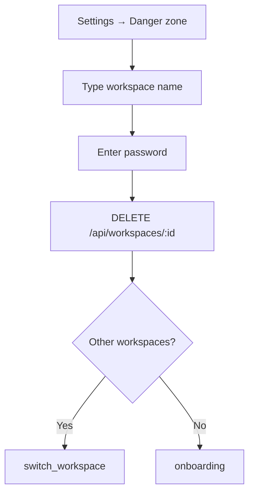

## Problem

Users need a safe way to permanently delete their account or workspace. Destructive actions must require explicit confirmation and password re-authentication to prevent accidental or unauthorized deletion.

## Solution

Account and workspace lifecycle APIs with typed confirmation fields, password re-auth, and cascading purge via service role client.

Shipped in **V16.2** (deletion) and **V16.3** (password re-auth requirement).

## Goals

- Allow workspace owners to permanently delete their workspace
- Allow users to delete their account (optionally including owned workspaces)
- Require password re-authentication before any destructive action
- Return clear next-action hints (switch workspace vs re-onboard)
- Preserve auth user safety — confirm email/name before purge

## User stories

| As a… | I want to… | So that… |
|-------|------------|----------|
| Workspace owner | Delete my workspace permanently | I can start fresh or leave the platform |
| User | Delete my account | My data is removed from AdeHQ |
| User | Re-authenticate with password | Accidental deletion is prevented |
| Developer | GET deletion context first | The UI can show warnings before confirming |

## Workspace deletion flow



Purges all workspace data via cascade: rooms, employees, messages, tasks, memory, approvals, work log, agent runs.

## Account deletion flow

1. `GET /api/account` — load owned workspaces and warnings
2. User confirms email + password + optional workspace deletion
3. `DELETE /api/account` — purge user data and auth record

## Password re-authentication

Added in V16.3. `requirePasswordReauth(user, password)` validates the current password against Supabase Auth before proceeding.

Required on:
- `DELETE /api/account`
- `DELETE /api/workspaces/:workspaceId`

## Database

Migration `20250629200000_workspace_owner_delete.sql`:

```sql
create policy "workspaces_delete_owner"
on public.workspaces for delete
using (owner_id = auth.uid());
```

## Technical implementation

| Component | Path |
|-----------|------|
| Lifecycle logic | `src/lib/server/account-lifecycle.ts` |
| Account API | `src/app/api/account/route.ts` |
| Workspace API | `src/app/api/workspaces/[workspaceId]/route.ts` |
| Password re-auth | `src/lib/supabase/auth-server.ts` |
| UI | `src/components/AccountDangerZone.tsx` |

## Related

- [Account & workspace API](/api/account-workspaces)
- [Clear workspace data](/features/work-graph) — non-destructive data wipe (preserves workspace)
