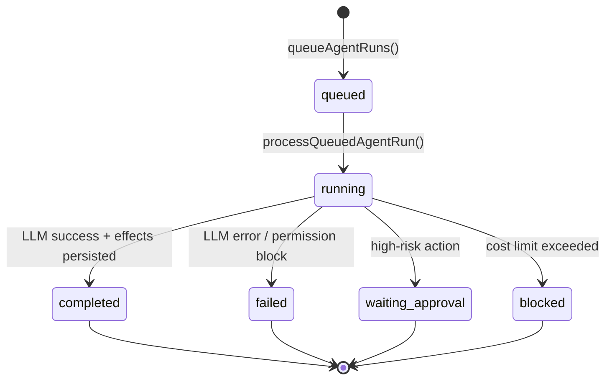

## Problem

Ad-hoc AI calls from the client are insecure (API keys exposed), untraceable (no audit trail), and unbounded (no cost controls). We need a server-side runtime that queues, executes, logs, and governs every AI interaction.

## Solution

An **AI runtime** backed by `agent_runs` — every AI response is a tracked job with steps, cost events, and links to the work graph.

## Goals

- Keep LLM API keys server-side only
- Queue and process AI responses asynchronously
- Track token usage and cost per workspace
- Enforce daily limits before runs start
- Link AI output to tasks, memory, approvals, and work log
- Support mock fallback when SiliconFlow is unavailable

## Non-goals

- Multi-provider routing (SiliconFlow only in production)
- BYOK per-workspace provider keys (schema exists, not implemented)
- Background workers / cron — client triggers `process` endpoint

## User stories

| As a… | I want to… | So that… |
|-------|------------|----------|
| Owner | Set daily token/cost limits | Runaway AI spend is prevented |
| Owner | Test SiliconFlow connectivity | I can verify config before debugging rooms |
| Owner | View runtime status | I see queued/running/failed runs |
| Developer | Trace a failed run | I can debug with step-level logs |
| Team member | @mention an employee | The AI reply appears in the same topic |

## Agent run lifecycle

## Run steps

Each run records steps in `agent_run_steps`:

- `thinking` — internal reasoning log
- `model_call` — LLM request/response metadata
- `tool_call` — tool invocation (future)
- `memory_write` — memory entry created
- `task_create` — task created
- `approval_request` — approval queued
- `error` — failure detail

## Cost governance

`workspace_ai_settings` controls:

| Setting | Purpose |
|---------|---------|
| `daily_token_limit` | Max tokens per calendar day |
| `daily_cost_limit_usd` | Max estimated cost per day |
| `max_parallel_runs` | Concurrent agent runs (default 3) |
| `max_handoff_depth` | Agent-to-agent chain limit |

Checked in `beginAiRun()` before queuing.

## Model routing

Employees select a `model_mode` (`cheap`, `balanced`, `strong`, `coding`, `long_context`, `creative`). The router in `src/lib/ai/model-router.ts` maps mode → SiliconFlow model env var.

Provider normalization: legacy `openai` values are coerced to `siliconflow` (migration `20250629140000`).

## Technical implementation

| Component | Path |
|-----------|------|
| Migration | `supabase/migrations/20250629120000_ai_runtime_and_work_graph.sql` |
| Process endpoint | `src/app/api/agent-runs/[runId]/process/route.ts` |
| Queue logic | `src/lib/server/queue-agent-runs.ts` |
| Run processor | `src/lib/server/process-queued-run.ts` |
| Cost guard | `src/lib/ai/cost-guard.ts` |
| Usage tracking | `src/lib/supabase/ai-runtime.ts` |
| Admin UI | `src/components/AiRuntimePanel.tsx` |
| Settings API | `/api/workspaces/:id/ai-settings`, `/api/ai/runtime` |

## Success metrics

- Every AI reply has an `agent_run_id` on the message row
- `ai_usage_events` records tokens and estimated cost
- Failed runs surface actionable errors (missing service role key, model errors)
- Fallback to mock engine does not crash the UI

## Environment requirements

| Variable | Required for live AI |
|----------|---------------------|
| `SILICONFLOW_API_KEY` | Yes |
| `SUPABASE_SERVICE_ROLE_KEY` | Yes (agent run processing) |
| `ADEHQ_SILICONFLOW_*` | Optional model overrides |
