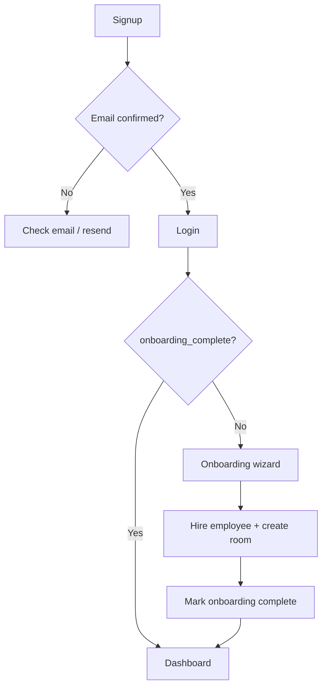

## Problem

New users need a secure account, a personal workspace, and enough initial setup to send their first message — without demo data polluting production.

## Solution

Supabase email/password auth with email confirmation, multi-workspace support, and a guided onboarding wizard that creates workspace + first employee + first room.

## Goals

- Email/password signup with confirmation
- Production workspaces start empty (no seeded demo data)
- Onboarding creates: workspace, first AI employee, first project room
- Multi-workspace switching for users in multiple orgs
- Resend confirmation for stuck signups

## Non-goals

- Social OAuth (Google, GitHub) — not implemented
- SSO / SAML
- Invite-only signup gating
- Organization billing

## User flow

## Workspace model

| Field | Purpose |
|-------|---------|
| `workspace_mode` | `real` (production) or `demo` (dev seed) |
| `onboarding_complete` | Gates AppShell until true |
| `owner_id` | FK to auth user |

Members have roles: `owner`, `admin`, `member`, `viewer`.

## Demo mode separation

Demo is **disabled by default**. When `NEXT_PUBLIC_ENABLE_DEMO_MODE=true`:

- Login page shows "Try demo workspace"
- `loginDemo()` loads in-memory state — no Supabase writes
- Demo seed introspection via `POST /api/dev/seed-demo` (development only)

Production users never see demo options.

## Technical implementation

| Component | Path |
|-----------|------|
| Login / signup | `src/app/(auth)/login/page.tsx`, `signup/page.tsx` |
| Email callback | `src/app/auth/callback/page.tsx` |
| Resend API | `/api/auth/resend-confirmation` (public) |
| Onboarding | `src/app/onboarding/page.tsx`, `OnboardingFlow.tsx` |
| AppShell gate | `src/components/AppShell.tsx` |
| Active workspace | `src/lib/supabase/active-workspace.ts` |
| Site URL | `NEXT_PUBLIC_SITE_URL` for redirect URLs |

## Supabase configuration

In Supabase → Authentication → URL configuration:

- **Site URL:** your deployment URL (e.g. `https://ade-hq-eight.vercel.app`)
- **Redirect URLs:** `https://your-app/**`

## Success metrics

- Signup → confirm → onboarding → first message works end-to-end
- Production workspaces have zero demo seed data
- Resend confirmation succeeds for unconfirmed users
- Workspace switcher persists selection in localStorage
